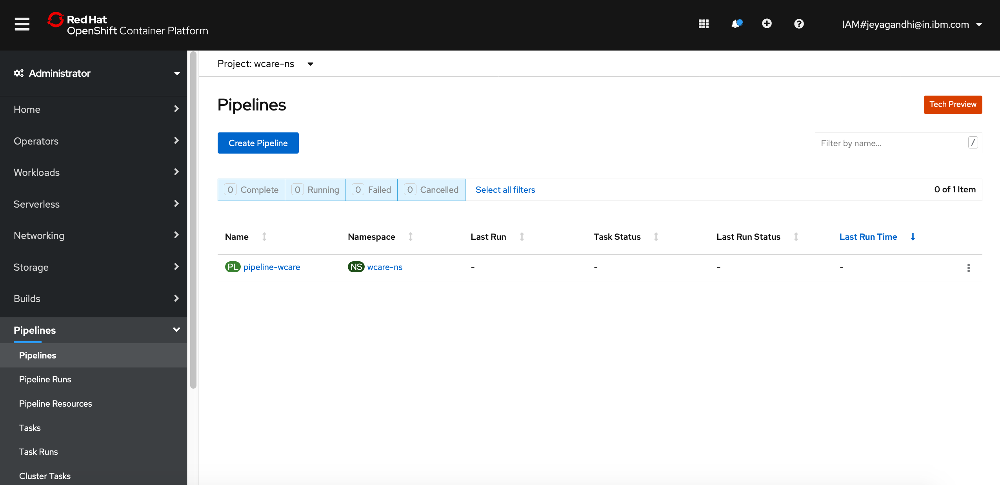

# WCare Tetkon Pipeline

Wcare consists of 3 microservices.
- Wcare Web
- Wcare Finanance
- Wcare User

This document explain about the following
1. How to install Wcare Tekton pipeline 
2. How to use this pipeline for building docker images and deploying the above microservices.

#### Pre Requiste

This pipeline would work in RedHat Openshift Container Platform version 4.3 and 4.4.  

Openshift Pipelines (Tekton) should have been installed and available on the RHOCP.

## Installing Wcare Pipeline

Follow the below steps to create Tekton pipeline for Wcare.

1. Download this project from git

2. Goto `pipeline/install` folder in command prompt

3. Login into Openshift using `oc login....`

4. Run the below command.

```
sh 01-install.sh
```

5. The Pipeline `pipeline-wcare` should have been created under `wcare-ns` namespace.



-------------

## Run Wcare Pipeline

Follow the below steps to run Tekton pipeline for Wcare microservices.

### 1. Run Pipeline for Wcare Web

#### Start the PipelineRun

Goto to the Pipelines screen and click on the `Start` menu.


It should open the Input param screens.

#### Enter Parameters

Enter the below values for the parameters.

```
git-source-repo = https://github.com/GandhiCloudLab/wcare-web

revision = master

docker-image-registry = image-registry.openshift-image-registry.svc:5000/wcare-ns/wcareweb:latest
```
You need to click on the `Tick` mark for each parameter to get add your value as a param.


#### Start run

Click on the Start button to run the pipeline. 

#### Run completes

Once the pipeline run is completed the screen would looks like this.


### 2. Run Pipeline for Wcare Finanace

Repeat the above steps for Finanance microservice. But you need to the below parameters.

```
git-source-repo = https://github.com/GandhiCloudLab/wcare-finance

revision = master

docker-image-registry = image-registry.openshift-image-registry.svc:5000/wcare-ns/wcarefinance:latest
```

It may show the previous params, you need to click on `Create New Pipeline Resource`

### 3. Run Pipeline for Wcare Finanace

Repeat the above steps for Finanance microservice. But you need to the below parameters.

```
git-source-repo = https://github.com/GandhiCloudLab/wcare-user

revision = master

docker-image-registry = image-registry.openshift-image-registry.svc:5000/wcare-ns/wcareuser:latest
```
It may show the previous params, you need to click on `Create New Pipeline Resource`

-------------

## Accessing Wcare Application.

1. Select the wcare-ns project in the OCP Console.

2. Goto Networking > Routes page.

3. Click on the Routes with the name 'wcareweb'


4. Login to the application with the below users.

```
sam/sam
harry/harry
sandy/sandy
```
